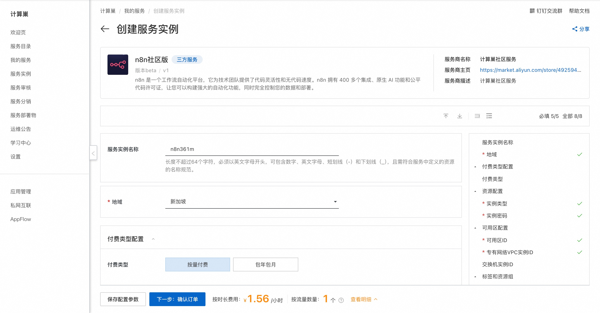
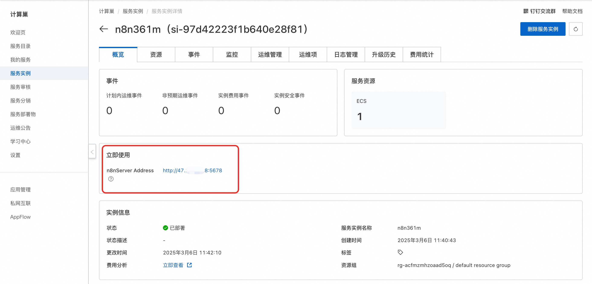
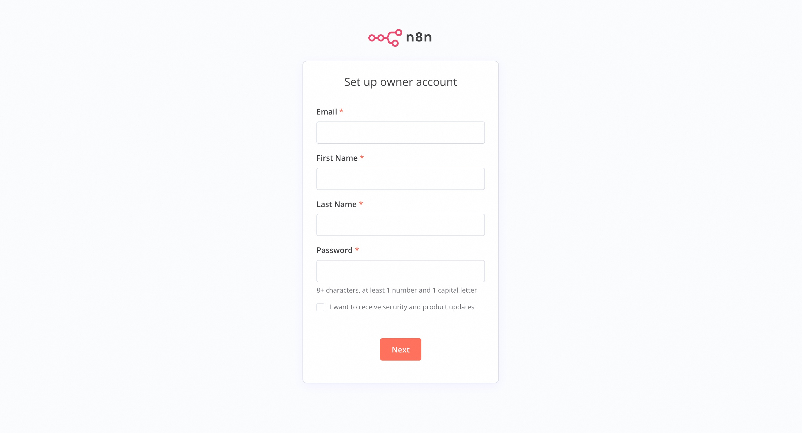

<h1>n8n Community Edition Rapid Deployment </h1>

<h2> Overview </h2>

n8n is a workflow automation platform that provides code flexibility and code-free speed for technical teams. With more than 400 integrations, native AI capabilities and fair code licenses, n8n lets you build powerful automation while taking complete control of your data and deployment. 

<h2> Prerequisites </h2>

 To deploy the n8n community edition service instance, you need to access and create some Alibaba Cloud resources. Therefore, your account must contain permissions for the following resources.
<strong> Note </strong>: This permission is required only when your account is a RAM account. 

<table>
<thead>
<tr>
<th> Permission policy name </th>
<th> Remarks </th>
</tr>
</thead>
<tbody>
<tr>
<td>AliyunECSFullAccess</td>
<td> Permissions to manage ECS </td>
</tr>
<tr>
<td>AliyunVPCFullAccess</td>
<td> Permissions for managing VPC networks </td>
</tr>
<tr>
<td>AliyunROSFullAccess</td>
<td> Manage permissions for Resource Orchestration Services (ROS) </td>
</tr>
<tr>
<td>AliyunComputeNestUserFullAccess</td>
<td> Manage user-side permissions for the compute nest service (ComputeNest) </td>
</tr>
</tbody>
</table>

<h2> Billing instructions </h2>

 the cost of deploying n8n community edition in computing nest mainly involves:

<ul>
<li> Selected vCPU and Memory Specifications </li>
<li> System disk type and capacity </li>
<li> Internet bandwidth </li>
</ul>

<h2> Deployment process </h2>

<ol>
<li>
 visit the computing nest n8n community version <a href = "https://computenest.console.aliyun.com/service/instance/create/cn-hangzhou?type=user&ServiceName=n8n社区版"> deployment link </a> and fill in the deployment parameters as prompted:

</li>
<li>
 after the parameters are filled in, you can see the corresponding inquiry details. after confirming the parameters, click <strong> next: confirm the order </strong>. 
</li>
<li>
 Confirm that the order is complete and agree to the service agreement and click <strong> Create Now </strong> to enter the deployment phase. 
</li>
<li>
 After the deployment is completed, you can start using the service. Enter the service instance details and click the service address.

</li>
<li>
 The n8n service can be used after loading.

</li>
</ol>

<h2> Using Help </h2>

 For more information, see <a href = "https://docs.n8n.io/">n8n official documentation </a>. 

